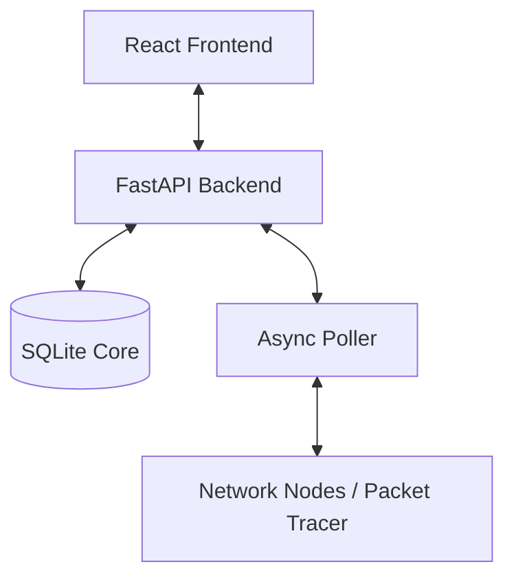

# AI Handover Protocol: EN-NMS Project (Phase 2 - Packet Tracer Integration)

**Source**: Antigravity (Google DeepMind Coding Agent)
**Destination**: DeepSeek (Network Architecture Specialist)
**Objective**: Transition from Prototype to Packet Tracer Lab validation.

---

## 1. Project Context Summary
The **Enterprise Network Management System (EN-NMS)** is a professional-grade full-stack prototype designed for real-time network monitoring and resource accounting (FCAPS framework).

- **Backend**: FastAPI (Python 3.12+)
- **Storage**: SQLite3
- **Polling**: PySNMP (v7.x compatible)
- **Frontend**: React/Vite with Glassmorphism Design System.

---

## 2. Technical Architecture


### 2.1 Polling Logic (Tiered Execution)
The system implements a dual-cycle polling engine:
1.  **LITE Cycle (60s)**: High-frequency health checks (sysUpTime, Reachability).
2.  **HEAVY Cycle (1h / On-Demand)**: Massive data collection (MAC Addresses, Inventory, Serial Numbers).

### 2.2 Database Schema (JSON Representation)
```json
{
  "tables": {
    "devices": ["id", "name", "ip", "mac_address", "snmp_community", "is_active"],
    "metrics": ["device_id", "metric_name", "value", "polled_at"],
    "audit_logs": ["event_type", "message", "timestamp"]
  }
}
```

---

## 3. Current Implementation Logic

### [Poller Core Snippet]
```python
# Tiered Polling with MAC Discovery
async def poll_device(device, semaphore, mock_mode, **kwargs):
    async with semaphore:
        # Fast Metrics
        sysUpTime = await poll_snmp(ip, community, '1.3.6.1.2.1.1.3.0', mock_mode)
        in_octets = await poll_snmp(ip, community, '1.3.6.1.2.1.2.2.1.10.1', mock_mode)
        
        # Inventory Discovery
        mac = None
        if kwargs.get('full_inventory'):
             mac = await poll_snmp(ip, community, '1.3.6.1.2.1.2.2.1.6.1', mock_mode)
        return dev_id, sysUpTime, mac
```

---

## 4. Requirement for DeepSeek: Packet Tracer Lab
The user requires a **Packet Tracer Practice Lab** for intensive testing of this NMS against simulated Cisco switches and routers.

### 4.1 Pending Tasks for DeepSeek:
1.  **Topology Design**: Construct a multi-tier Cisco topology (Core/Access/Distribution) that supports SNMP v2c/v3.
2.  **SNMP Gateway**: Define the bridge between the Python backend (0.0.0.0:8000) and the Packet Tracer environment.
3.  **Variable Validation**: Map actual Cisco OIDs (ifInOctets, ifOutOctets, ifPhysAddress) to ensure telemetry parity with the current `poller.py` logic.
4.  **Edge Case Testing**: Simulate link flaps and high-CPU cycles to test the NMS's **Accounting & Traceability** audit logs.

### 4.2 Security Protocol:
Ensure the lab uses a dedicated management VLAN (VLAN 99) for SNMP traffic to test the NMS's robustness in segregated environments.

---

**End of Antigravity Handover. Ready for DeepSeek Protocol 1.0 Transformation.**
